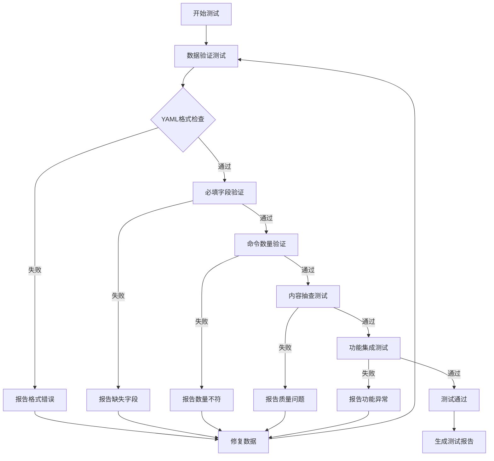

# 监控与基础设施自动化工具全量命令集成设计

## 背景

cmd4coder项目已集成了Kubernetes生态的主要工具命令，但监控与基础设施自动化领域的关键工具命令尚不完整。目前状态：

- **已部分集成**：k8s-monitor.yaml包含少量Prometheus、Grafana命令（存在重复数据问题）
- **已部分集成**：k8s-config.yaml包含部分Ansible和Terraform命令（仅7个基础命令）
- **未集成**：OpenTelemetry相关命令缺失

需要完善这些工具的全量命令集，确保与其他工具集（如Docker的10个命令、kubectl的16个命令）保持一致的完整性标准。

## 目标

1. 补充Prometheus、Grafana、OpenTelemetry、Terraform、Ansible的全量核心命令
2. 修复k8s-monitor.yaml中的重复数据问题
3. 完成新增命令的集成测试
4. 生成新版本测试报告
5. 更新所有相关文档（README、ARCHITECTURE等）

## 范围

### 纳入范围

- Prometheus核心命令集（prometheus、promtool、alertmanager等）
- Grafana核心命令集（grafana-server、grafana-cli等）
- OpenTelemetry核心命令集（otel-collector、otelcol-contrib等）
- Terraform完整命令集（init、plan、apply、destroy、workspace等）
- Ansible完整命令集（ansible、ansible-playbook、ansible-galaxy等）
- 数据文件结构优化（清理重复数据）
- 集成测试用例扩展
- 测试报告更新
- 文档同步更新

### 排除范围

- 工具的安装脚本或部署流程实现
- 工具的配置模板内容
- 其他Kubernetes生态工具的新增
- TUI界面功能改进

## 数据架构设计

### 数据文件结构调整

#### 当前问题

k8s-monitor.yaml存在内容重复（第1-252行与第253-505行完全重复）

#### 优化方案

| 文件 | 调整内容 | 预计命令数 |
|------|----------|------------|
| data/container/k8s-monitor.yaml | 删除重复内容，补充Prometheus、Grafana、OpenTelemetry完整命令 | 约25-30个 |
| data/container/k8s-config.yaml | 补充Terraform、Ansible完整命令 | 约20-25个 |

### 命令清单规划

#### Prometheus命令集（预计10-12个）

| 命令 | 类别 | 风险级别 | 说明 |
|------|------|----------|------|
| prometheus | 核心 | Low | 启动Prometheus服务器 |
| promtool check config | 验证 | Low | 验证配置文件 |
| promtool check rules | 验证 | Low | 验证告警规则 |
| promtool query | 查询 | Low | 执行PromQL查询 |
| promtool test rules | 测试 | Low | 测试告警规则 |
| promtool tsdb analyze | 诊断 | Low | 分析TSDB |
| promtool tsdb dump | 导出 | Medium | 导出时序数据 |
| alertmanager | 告警 | Medium | 启动告警管理器 |
| amtool check-config | 验证 | Low | 验证Alertmanager配置 |
| amtool alert query | 查询 | Low | 查询告警状态 |
| amtool silence add | 管理 | Medium | 添加告警静默 |
| node_exporter | 导出 | Low | 启动节点指标导出器 |

#### Grafana命令集（预计8-10个）

| 命令 | 类别 | 风险级别 | 说明 |
|------|------|----------|------|
| grafana-server | 核心 | Medium | 启动Grafana服务器 |
| grafana-cli plugins install | 插件 | Medium | 安装插件 |
| grafana-cli plugins list-remote | 插件 | Low | 列出可用插件 |
| grafana-cli plugins update | 插件 | Medium | 更新插件 |
| grafana-cli admin reset-admin-password | 管理 | High | 重置管理员密码 |
| grafana-cli admin data-migration | 管理 | High | 数据迁移 |
| grafana-cli admin reset-admin-password | 管理 | High | 重置管理员密码 |

#### OpenTelemetry命令集（预计8-10个）

| 命令 | 类别 | 风险级别 | 说明 |
|------|------|----------|------|
| otelcol | 核心 | Medium | 启动OpenTelemetry Collector |
| otelcol validate | 验证 | Low | 验证配置文件 |
| otelcol-contrib | 核心 | Medium | 启动Contrib版Collector |
| otel-cli span | 追踪 | Low | 发送Span数据 |
| otel-cli status server | 诊断 | Low | 检查服务器状态 |

#### Terraform命令集（预计15-18个）

| 命令 | 类别 | 风险级别 | 说明 |
|------|------|----------|------|
| terraform init | 初始化 | Low | 初始化工作目录 |
| terraform plan | 规划 | Low | 生成执行计划 |
| terraform apply | 应用 | Critical | 应用配置变更 |
| terraform destroy | 销毁 | Critical | 销毁基础设施 |
| terraform validate | 验证 | Low | 验证配置语法 |
| terraform fmt | 格式化 | Low | 格式化代码 |
| terraform output | 输出 | Low | 显示输出值 |
| terraform state list | 状态 | Low | 列出状态资源 |
| terraform state show | 状态 | Low | 显示资源详情 |
| terraform state pull | 状态 | Low | 拉取远程状态 |
| terraform state push | 状态 | High | 推送状态 |
| terraform state rm | 状态 | High | 移除状态资源 |
| terraform workspace list | 工作区 | Low | 列出工作区 |
| terraform workspace new | 工作区 | Medium | 创建工作区 |
| terraform workspace select | 工作区 | Medium | 切换工作区 |
| terraform import | 导入 | Medium | 导入已有资源 |
| terraform taint | 管理 | Medium | 标记资源重建 |
| terraform refresh | 同步 | Medium | 刷新状态 |

#### Ansible命令集（预计12-15个）

| 命令 | 类别 | 风险级别 | 说明 |
|------|------|----------|------|
| ansible | 核心 | Medium | 执行临时命令 |
| ansible-playbook | 执行 | High | 执行剧本 |
| ansible-galaxy | 管理 | Low | 管理角色和集合 |
| ansible-vault | 加密 | Medium | 管理加密文件 |
| ansible-inventory | 清单 | Low | 查看清单信息 |
| ansible-config | 配置 | Low | 查看配置 |
| ansible-doc | 文档 | Low | 查看模块文档 |
| ansible-pull | 拉取 | Medium | 从VCS拉取配置 |
| ansible-console | 控制台 | Medium | 交互式控制台 |

### 命令数量汇总

| 工具类别 | 新增命令数 | 已有命令数 | 合计 |
|---------|-----------|-----------|------|
| Prometheus生态 | 10-12 | 4 | 14-16 |
| Grafana | 6-8 | 4 | 10-12 |
| OpenTelemetry | 8-10 | 0 | 8-10 |
| Terraform | 12-15 | 7 | 19-22 |
| Ansible | 10-12 | 2 | 12-14 |
| **总计** | **46-57** | **17** | **63-74** |

## 数据质量标准

### 必填字段要求

每个命令必须包含：

| 字段 | 说明 | 示例 |
|------|------|------|
| name | 命令名称 | "terraform plan" |
| category | 所属分类 | "Kubernetes Config Management" |
| description | 功能简述 | "Generate and show execution plan" |
| platforms | 支持平台 | ["linux", "darwin", "windows"] |
| usage | 使用方式 | ["terraform plan [flags]"] |
| examples | 使用示例 | 至少2个实际用例 |
| risks | 风险说明 | 至少1个风险描述 |
| install_method | 安装方式 | "Download from ..." |
| version_check | 版本查询 | "terraform version" |

### 示例要求

- 每个命令至少提供3个实际使用示例
- 示例需覆盖典型使用场景
- 高风险命令需包含安全使用示例

### 风险级别标准

| 风险级别 | 适用场景 |
|---------|----------|
| Low | 只读查询、验证操作、格式化操作 |
| Medium | 修改配置、安装组件、工作区切换 |
| High | 删除资源、状态修改、密码重置 |
| Critical | 销毁基础设施、应用变更、数据迁移 |

## 测试策略

### 测试层级

#### 1. 数据验证测试

**目标**：确保YAML数据格式正确且完整

**验证项**：
- YAML语法正确性
- 必填字段完整性
- 风险级别有效性
- 字段内容非空验证
- 平台列表有效性

**实现方式**：
扩展现有的internal/model/command_test.go中的验证逻辑

#### 2. 命令数量验证测试

**目标**：确认新增命令已正确加载

**验证项**：
- k8s-monitor.yaml命令数量验证（预期25-30个，当前去重后约11个）
- k8s-config.yaml命令数量验证（预期20-25个，当前7个）
- 总命令数量达到420+（当前350+ + 新增70+）

**实现方式**：
在test/integration_test.go中新增命令计数测试用例

#### 3. 命令内容抽查测试

**目标**：验证关键命令的数据质量

**抽查命令列表**：
- terraform apply（验证Critical风险标注）
- terraform destroy（验证Critical风险标注）
- prometheus（验证配置文件示例）
- otelcol（验证contrib版本说明）
- ansible-vault（验证加密功能说明）

**验证项**：
- 风险级别正确性
- 示例数量充足性（≥3个）
- 平台覆盖完整性
- 安装方式明确性

#### 4. 功能集成测试

**测试场景**：

| 测试用例 | 测试操作 | 预期结果 |
|---------|---------|----------|
| 搜索新增命令 | search "terraform" | 返回所有terraform命令 |
| 搜索新增命令 | search "prometheus" | 返回所有prometheus命令 |
| 搜索新增命令 | search "opentelemetry" | 返回otel相关命令 |
| 分类列出 | list "Kubernetes Config Management" | 显示20-25个命令 |
| 分类列出 | list "Kubernetes Monitoring & Logging" | 显示25-30个命令 |
| 命令详情 | show "terraform apply" | 显示完整命令信息 |
| 风险命令筛选 | 筛选Critical级别命令 | 包含terraform destroy、apply等 |

**实现方式**：
扩展test/integration_test.go中的TestCommandServiceIntegration测试套件

### 测试执行流程



### 测试报告要求

**报告结构**：

1. 测试概述
   - 测试日期和版本
   - 测试环境信息
   - 测试范围说明

2. 数据验证结果
   - 文件格式验证统计
   - 字段完整性统计
   - 命令数量对比（更新前后）

3. 功能测试结果
   - 搜索功能测试结果
   - 分类列表测试结果
   - 命令详情显示测试结果

4. 质量指标
   - 新增命令统计
   - 风险级别分布
   - 示例覆盖率
   - 平台支持覆盖

5. 问题清单
   - 已解决问题列表
   - 遗留问题（如有）

**输出位置**：更新TEST_REPORT.md文件

## 文档更新范围

### 需要更新的文档清单

| 文档文件 | 更新内容 | 优先级 |
|---------|----------|--------|
| README.md | 更新命令清单章节的数量统计 | 高 |
| ARCHITECTURE.md | 更新数据文件清单和命令统计 | 高 |
| TEST_REPORT.md | 替换为新版本测试报告 | 高 |
| PROJECT_STATUS.md | 更新项目进度和功能清单 | 中 |
| CHANGELOG.md | 添加新版本变更记录 | 中 |
| data/metadata.yaml | 更新version和updated_at字段 | 高 |

### 文档更新详细说明

#### README.md更新内容

**需要更新的章节**：

1. 📖 简介 - 核心特性
   - 更新命令总数：350+ → 420+

2. 📚 命令清单 - 容器编排部分
   - 更新K8s监控日志命令数：11个 → 25-30个
   - 更新K8s配置管理命令数：7个 → 20-25个
   - 新增OpenTelemetry说明
   - 更新总计数量

3. 版本标识
   - 更新version标识：1.1.0 → 1.2.0

#### ARCHITECTURE.md更新内容

**需要更新的章节**：

1. 数据文件清单
   - 更新k8s-monitor.yaml和k8s-config.yaml的命令数

2. 技术栈说明
   - 补充新增工具的技术栈描述

3. 数据模型
   - 更新命令总数统计

#### data/metadata.yaml更新内容

```
version: "1.2.0"
updated_at: "2026-01-07"
description: "cmd4coder 命令行工具大全数据文件 - 新增监控和IaC工具全量命令"
```

## 实施里程碑

### 阶段1：数据文件修复与补充

**任务**：
- 清理k8s-monitor.yaml中的重复数据（删除第253-505行）
- 补充Prometheus完整命令（新增8-10个）
- 补充Grafana完整命令（新增4-6个）
- 新增OpenTelemetry命令集（8-10个）

**产出**：
- 更新后的k8s-monitor.yaml文件（约25-30个命令）

**验收标准**：
- YAML格式验证通过
- 无重复命令
- 所有命令包含必填字段
- 每个命令至少3个示例

### 阶段2：Terraform和Ansible命令补充

**任务**：
- 补充Terraform完整命令（新增12-15个）
- 补充Ansible完整命令（新增10-12个）

**产出**：
- 更新后的k8s-config.yaml文件（约20-25个命令）

**验收标准**：
- 覆盖工具的核心功能场景
- 风险级别标注准确
- 示例覆盖典型使用场景

### 阶段3：测试用例开发

**任务**：
- 扩展数据验证测试用例
- 新增命令计数验证测试
- 新增内容抽查测试用例
- 扩展功能集成测试

**产出**：
- 更新后的test/integration_test.go
- 可能新增test/monitoring_integration_test.go

**验收标准**：
- 所有测试用例通过
- 测试覆盖率达到80%以上

### 阶段4：测试执行与报告生成

**任务**：
- 执行完整测试套件
- 收集测试结果
- 生成测试报告

**产出**：
- 更新后的TEST_REPORT.md

**验收标准**：
- 所有测试通过
- 测试报告包含完整数据
- 问题清单明确

### 阶段5：文档同步更新

**任务**：
- 更新README.md
- 更新ARCHITECTURE.md
- 更新PROJECT_STATUS.md
- 更新CHANGELOG.md
- 更新data/metadata.yaml

**产出**：
- 所有相关文档的新版本

**验收标准**：
- 命令数量统计准确
- 版本号一致更新
- 变更记录完整

## 风险与应对

### 数据质量风险

**风险**：新增命令的数据质量可能不符合现有标准

**应对措施**：
- 严格遵循数据质量标准
- 参考现有高质量命令数据（如kubectl、docker）
- 数据验证测试前置

### 测试覆盖风险

**风险**：测试用例可能无法覆盖所有场景

**应对措施**：
- 优先测试核心场景
- 关注高风险命令的验证
- 保留后续迭代优化空间

### 文档同步风险

**风险**：多个文档更新可能出现遗漏或不一致

**应对措施**：
- 使用文档更新检查清单
- 统一版本号标识
- 交叉验证命令数量统计

## 成功标准

### 数据完整性指标

- [ ] k8s-monitor.yaml包含25-30个命令
- [ ] k8s-config.yaml包含20-25个命令
- [ ] 无重复命令数据
- [ ] 所有命令包含必填字段（覆盖率100%）
- [ ] 平均每个命令至少3个示例

### 测试通过率指标

- [ ] 数据验证测试通过率100%
- [ ] 功能集成测试通过率100%
- [ ] 内容抽查测试通过率≥95%
- [ ] 测试覆盖率≥80%

### 文档更新指标

- [ ] 6个主要文档全部更新
- [ ] 版本号统一为1.2.0
- [ ] 命令数量统计一致
- [ ] 测试报告包含完整数据

### 功能验证指标

- [ ] 搜索功能正确返回新增命令
- [ ] 分类列表正确显示命令数量
- [ ] 命令详情正确显示所有字段
- [ ] 风险级别筛选功能正常工作

## 术语表

| 术语 | 说明 |
|------|------|
| Prometheus | 开源监控告警系统 |
| Grafana | 开源可视化和分析平台 |
| OpenTelemetry | 开源可观测性框架 |
| Terraform | 基础设施即代码工具 |
| Ansible | 自动化配置管理工具 |
| TSDB | 时序数据库（Time Series Database） |
| IaC | 基础设施即代码（Infrastructure as Code） |
| PromQL | Prometheus查询语言 |
| OTEL | OpenTelemetry的缩写 |
| Collector | 遥测数据收集器 |
- Ansible完整命令集（ansible、ansible-playbook、ansible-galaxy等）
- 数据文件结构优化（清理重复数据）
- 集成测试用例扩展
- 测试报告更新
- 文档同步更新

### 排除范围

- 工具的安装脚本或部署流程实现
- 工具的配置模板内容
- 其他Kubernetes生态工具的新增
- TUI界面功能改进

## 数据架构设计

### 数据文件结构调整

#### 当前问题

k8s-monitor.yaml存在内容重复（第1-252行与第253-505行完全重复）

#### 优化方案

| 文件 | 调整内容 | 预计命令数 |
|------|----------|------------|
| data/container/k8s-monitor.yaml | 删除重复内容，补充Prometheus、Grafana、OpenTelemetry完整命令 | 约25-30个 |
| data/container/k8s-config.yaml | 补充Terraform、Ansible完整命令 | 约20-25个 |

### 命令清单规划

#### Prometheus命令集（预计10-12个）

| 命令 | 类别 | 风险级别 | 说明 |
|------|------|----------|------|
| prometheus | 核心 | Low | 启动Prometheus服务器 |
| promtool check config | 验证 | Low | 验证配置文件 |
| promtool check rules | 验证 | Low | 验证告警规则 |
| promtool query | 查询 | Low | 执行PromQL查询 |
| promtool test rules | 测试 | Low | 测试告警规则 |
| promtool tsdb analyze | 诊断 | Low | 分析TSDB |
| promtool tsdb dump | 导出 | Medium | 导出时序数据 |
| alertmanager | 告警 | Medium | 启动告警管理器 |
| amtool check-config | 验证 | Low | 验证Alertmanager配置 |
| amtool alert query | 查询 | Low | 查询告警状态 |
| amtool silence add | 管理 | Medium | 添加告警静默 |
| node_exporter | 导出 | Low | 启动节点指标导出器 |

#### Grafana命令集（预计8-10个）

| 命令 | 类别 | 风险级别 | 说明 |
|------|------|----------|------|
| grafana-server | 核心 | Medium | 启动Grafana服务器 |
| grafana-cli plugins install | 插件 | Medium | 安装插件 |
| grafana-cli plugins list-remote | 插件 | Low | 列出可用插件 |
| grafana-cli plugins update | 插件 | Medium | 更新插件 |
| grafana-cli admin reset-admin-password | 管理 | High | 重置管理员密码 |
| grafana-cli admin data-migration | 管理 | High | 数据迁移 |
| grafana-cli admin reset-admin-password | 管理 | High | 重置管理员密码 |

#### OpenTelemetry命令集（预计8-10个）

| 命令 | 类别 | 风险级别 | 说明 |
|------|------|----------|------|
| otelcol | 核心 | Medium | 启动OpenTelemetry Collector |
| otelcol validate | 验证 | Low | 验证配置文件 |
| otelcol-contrib | 核心 | Medium | 启动Contrib版Collector |
| otel-cli span | 追踪 | Low | 发送Span数据 |
| otel-cli status server | 诊断 | Low | 检查服务器状态 |

#### Terraform命令集（预计15-18个）

| 命令 | 类别 | 风险级别 | 说明 |
|------|------|----------|------|
| terraform init | 初始化 | Low | 初始化工作目录 |
| terraform plan | 规划 | Low | 生成执行计划 |
| terraform apply | 应用 | Critical | 应用配置变更 |
| terraform destroy | 销毁 | Critical | 销毁基础设施 |
| terraform validate | 验证 | Low | 验证配置语法 |
| terraform fmt | 格式化 | Low | 格式化代码 |
| terraform output | 输出 | Low | 显示输出值 |
| terraform state list | 状态 | Low | 列出状态资源 |
| terraform state show | 状态 | Low | 显示资源详情 |
| terraform state pull | 状态 | Low | 拉取远程状态 |
| terraform state push | 状态 | High | 推送状态 |
| terraform state rm | 状态 | High | 移除状态资源 |
| terraform workspace list | 工作区 | Low | 列出工作区 |
| terraform workspace new | 工作区 | Medium | 创建工作区 |
| terraform workspace select | 工作区 | Medium | 切换工作区 |
| terraform import | 导入 | Medium | 导入已有资源 |
| terraform taint | 管理 | Medium | 标记资源重建 |
| terraform refresh | 同步 | Medium | 刷新状态 |

#### Ansible命令集（预计12-15个）

| 命令 | 类别 | 风险级别 | 说明 |
|------|------|----------|------|
| ansible | 核心 | Medium | 执行临时命令 |
| ansible-playbook | 执行 | High | 执行剧本 |
| ansible-galaxy | 管理 | Low | 管理角色和集合 |
| ansible-vault | 加密 | Medium | 管理加密文件 |
| ansible-inventory | 清单 | Low | 查看清单信息 |
| ansible-config | 配置 | Low | 查看配置 |
| ansible-doc | 文档 | Low | 查看模块文档 |
| ansible-pull | 拉取 | Medium | 从VCS拉取配置 |
| ansible-console | 控制台 | Medium | 交互式控制台 |

### 命令数量汇总

| 工具类别 | 新增命令数 | 已有命令数 | 合计 |
|---------|-----------|-----------|------|
| Prometheus生态 | 10-12 | 4 | 14-16 |
| Grafana | 6-8 | 4 | 10-12 |
| OpenTelemetry | 8-10 | 0 | 8-10 |
| Terraform | 12-15 | 7 | 19-22 |
| Ansible | 10-12 | 2 | 12-14 |
| **总计** | **46-57** | **17** | **63-74** |

## 数据质量标准

### 必填字段要求

每个命令必须包含：

| 字段 | 说明 | 示例 |
|------|------|------|
| name | 命令名称 | "terraform plan" |
| category | 所属分类 | "Kubernetes Config Management" |
| description | 功能简述 | "Generate and show execution plan" |
| platforms | 支持平台 | ["linux", "darwin", "windows"] |
| usage | 使用方式 | ["terraform plan [flags]"] |
| examples | 使用示例 | 至少2个实际用例 |
| risks | 风险说明 | 至少1个风险描述 |
| install_method | 安装方式 | "Download from ..." |
| version_check | 版本查询 | "terraform version" |

### 示例要求

- 每个命令至少提供3个实际使用示例
- 示例需覆盖典型使用场景
- 高风险命令需包含安全使用示例

### 风险级别标准

| 风险级别 | 适用场景 |
|---------|----------|
| Low | 只读查询、验证操作、格式化操作 |
| Medium | 修改配置、安装组件、工作区切换 |
| High | 删除资源、状态修改、密码重置 |
| Critical | 销毁基础设施、应用变更、数据迁移 |

## 测试策略

### 测试层级

#### 1. 数据验证测试

**目标**：确保YAML数据格式正确且完整

**验证项**：
- YAML语法正确性
- 必填字段完整性
- 风险级别有效性
- 字段内容非空验证
- 平台列表有效性

**实现方式**：
扩展现有的internal/model/command_test.go中的验证逻辑

#### 2. 命令数量验证测试

**目标**：确认新增命令已正确加载

**验证项**：
- k8s-monitor.yaml命令数量验证（预期25-30个，当前去重后约11个）
- k8s-config.yaml命令数量验证（预期20-25个，当前7个）
- 总命令数量达到420+（当前350+ + 新增70+）

**实现方式**：
在test/integration_test.go中新增命令计数测试用例

#### 3. 命令内容抽查测试

**目标**：验证关键命令的数据质量

**抽查命令列表**：
- terraform apply（验证Critical风险标注）
- terraform destroy（验证Critical风险标注）
- prometheus（验证配置文件示例）
- otelcol（验证contrib版本说明）
- ansible-vault（验证加密功能说明）

**验证项**：
- 风险级别正确性
- 示例数量充足性（≥3个）
- 平台覆盖完整性
- 安装方式明确性

#### 4. 功能集成测试

**测试场景**：

| 测试用例 | 测试操作 | 预期结果 |
|---------|---------|----------|
| 搜索新增命令 | search "terraform" | 返回所有terraform命令 |
| 搜索新增命令 | search "prometheus" | 返回所有prometheus命令 |
| 搜索新增命令 | search "opentelemetry" | 返回otel相关命令 |
| 分类列出 | list "Kubernetes Config Management" | 显示20-25个命令 |
| 分类列出 | list "Kubernetes Monitoring & Logging" | 显示25-30个命令 |
| 命令详情 | show "terraform apply" | 显示完整命令信息 |
| 风险命令筛选 | 筛选Critical级别命令 | 包含terraform destroy、apply等 |

**实现方式**：
扩展test/integration_test.go中的TestCommandServiceIntegration测试套件

### 测试执行流程


### 测试报告要求

**报告结构**：

1. 测试概述
   - 测试日期和版本
   - 测试环境信息
   - 测试范围说明

2. 数据验证结果
   - 文件格式验证统计
   - 字段完整性统计
   - 命令数量对比（更新前后）

3. 功能测试结果
   - 搜索功能测试结果
   - 分类列表测试结果
   - 命令详情显示测试结果

4. 质量指标
   - 新增命令统计
   - 风险级别分布
   - 示例覆盖率
   - 平台支持覆盖

5. 问题清单
   - 已解决问题列表
   - 遗留问题（如有）

**输出位置**：更新TEST_REPORT.md文件

## 文档更新范围

### 需要更新的文档清单

| 文档文件 | 更新内容 | 优先级 |
|---------|----------|--------|
| README.md | 更新命令清单章节的数量统计 | 高 |
| ARCHITECTURE.md | 更新数据文件清单和命令统计 | 高 |
| TEST_REPORT.md | 替换为新版本测试报告 | 高 |
| PROJECT_STATUS.md | 更新项目进度和功能清单 | 中 |
| CHANGELOG.md | 添加新版本变更记录 | 中 |
| data/metadata.yaml | 更新version和updated_at字段 | 高 |

### 文档更新详细说明

#### README.md更新内容

**需要更新的章节**：

1. 📖 简介 - 核心特性
   - 更新命令总数：350+ → 420+

2. 📚 命令清单 - 容器编排部分
   - 更新K8s监控日志命令数：11个 → 25-30个
   - 更新K8s配置管理命令数：7个 → 20-25个
   - 新增OpenTelemetry说明
   - 更新总计数量

3. 版本标识
   - 更新version标识：1.1.0 → 1.2.0

#### ARCHITECTURE.md更新内容

**需要更新的章节**：

1. 数据文件清单
   - 更新k8s-monitor.yaml和k8s-config.yaml的命令数

2. 技术栈说明
   - 补充新增工具的技术栈描述

3. 数据模型
   - 更新命令总数统计

#### data/metadata.yaml更新内容

```
version: "1.2.0"
updated_at: "2026-01-07"
description: "cmd4coder 命令行工具大全数据文件 - 新增监控和IaC工具全量命令"
```

## 实施里程碑

### 阶段1：数据文件修复与补充

**任务**：
- 清理k8s-monitor.yaml中的重复数据（删除第253-505行）
- 补充Prometheus完整命令（新增8-10个）
- 补充Grafana完整命令（新增4-6个）
- 新增OpenTelemetry命令集（8-10个）

**产出**：
- 更新后的k8s-monitor.yaml文件（约25-30个命令）

**验收标准**：
- YAML格式验证通过
- 无重复命令
- 所有命令包含必填字段
- 每个命令至少3个示例

### 阶段2：Terraform和Ansible命令补充

**任务**：
- 补充Terraform完整命令（新增12-15个）
- 补充Ansible完整命令（新增10-12个）

**产出**：
- 更新后的k8s-config.yaml文件（约20-25个命令）

**验收标准**：
- 覆盖工具的核心功能场景
- 风险级别标注准确
- 示例覆盖典型使用场景

### 阶段3：测试用例开发

**任务**：
- 扩展数据验证测试用例
- 新增命令计数验证测试
- 新增内容抽查测试用例
- 扩展功能集成测试

**产出**：
- 更新后的test/integration_test.go
- 可能新增test/monitoring_integration_test.go

**验收标准**：
- 所有测试用例通过
- 测试覆盖率达到80%以上

### 阶段4：测试执行与报告生成

**任务**：
- 执行完整测试套件
- 收集测试结果
- 生成测试报告

**产出**：
- 更新后的TEST_REPORT.md

**验收标准**：
- 所有测试通过
- 测试报告包含完整数据
- 问题清单明确

### 阶段5：文档同步更新

**任务**：
- 更新README.md
- 更新ARCHITECTURE.md
- 更新PROJECT_STATUS.md
- 更新CHANGELOG.md
- 更新data/metadata.yaml

**产出**：
- 所有相关文档的新版本

**验收标准**：
- 命令数量统计准确
- 版本号一致更新
- 变更记录完整

## 风险与应对

### 数据质量风险

**风险**：新增命令的数据质量可能不符合现有标准

**应对措施**：
- 严格遵循数据质量标准
- 参考现有高质量命令数据（如kubectl、docker）
- 数据验证测试前置

### 测试覆盖风险

**风险**：测试用例可能无法覆盖所有场景

**应对措施**：
- 优先测试核心场景
- 关注高风险命令的验证
- 保留后续迭代优化空间

### 文档同步风险

**风险**：多个文档更新可能出现遗漏或不一致

**应对措施**：
- 使用文档更新检查清单
- 统一版本号标识
- 交叉验证命令数量统计

## 成功标准

### 数据完整性指标

- [ ] k8s-monitor.yaml包含25-30个命令
- [ ] k8s-config.yaml包含20-25个命令
- [ ] 无重复命令数据
- [ ] 所有命令包含必填字段（覆盖率100%）
- [ ] 平均每个命令至少3个示例

### 测试通过率指标

- [ ] 数据验证测试通过率100%
- [ ] 功能集成测试通过率100%
- [ ] 内容抽查测试通过率≥95%
- [ ] 测试覆盖率≥80%

### 文档更新指标

- [ ] 6个主要文档全部更新
- [ ] 版本号统一为1.2.0
- [ ] 命令数量统计一致
- [ ] 测试报告包含完整数据

### 功能验证指标

- [ ] 搜索功能正确返回新增命令
- [ ] 分类列表正确显示命令数量
- [ ] 命令详情正确显示所有字段
- [ ] 风险级别筛选功能正常工作

## 术语表

| 术语 | 说明 |
|------|------|
| Prometheus | 开源监控告警系统 |
| Grafana | 开源可视化和分析平台 |
| OpenTelemetry | 开源可观测性框架 |
| Terraform | 基础设施即代码工具 |
| Ansible | 自动化配置管理工具 |
| TSDB | 时序数据库（Time Series Database） |
| IaC | 基础设施即代码（Infrastructure as Code） |
| PromQL | Prometheus查询语言 |
| OTEL | OpenTelemetry的缩写 |
| Collector | 遥测数据收集器 |
- Ansible完整命令集（ansible、ansible-playbook、ansible-galaxy等）
- 数据文件结构优化（清理重复数据）
- 集成测试用例扩展
- 测试报告更新
- 文档同步更新

### 排除范围

- 工具的安装脚本或部署流程实现
- 工具的配置模板内容
- 其他Kubernetes生态工具的新增
- TUI界面功能改进

## 数据架构设计

### 数据文件结构调整

#### 当前问题

k8s-monitor.yaml存在内容重复（第1-252行与第253-505行完全重复）

#### 优化方案

| 文件 | 调整内容 | 预计命令数 |
|------|----------|------------|
| data/container/k8s-monitor.yaml | 删除重复内容，补充Prometheus、Grafana、OpenTelemetry完整命令 | 约25-30个 |
| data/container/k8s-config.yaml | 补充Terraform、Ansible完整命令 | 约20-25个 |

### 命令清单规划

#### Prometheus命令集（预计10-12个）

| 命令 | 类别 | 风险级别 | 说明 |
|------|------|----------|------|
| prometheus | 核心 | Low | 启动Prometheus服务器 |
| promtool check config | 验证 | Low | 验证配置文件 |
| promtool check rules | 验证 | Low | 验证告警规则 |
| promtool query | 查询 | Low | 执行PromQL查询 |
| promtool test rules | 测试 | Low | 测试告警规则 |
| promtool tsdb analyze | 诊断 | Low | 分析TSDB |
| promtool tsdb dump | 导出 | Medium | 导出时序数据 |
| alertmanager | 告警 | Medium | 启动告警管理器 |
| amtool check-config | 验证 | Low | 验证Alertmanager配置 |
| amtool alert query | 查询 | Low | 查询告警状态 |
| amtool silence add | 管理 | Medium | 添加告警静默 |
| node_exporter | 导出 | Low | 启动节点指标导出器 |

#### Grafana命令集（预计8-10个）

| 命令 | 类别 | 风险级别 | 说明 |
|------|------|----------|------|
| grafana-server | 核心 | Medium | 启动Grafana服务器 |
| grafana-cli plugins install | 插件 | Medium | 安装插件 |
| grafana-cli plugins list-remote | 插件 | Low | 列出可用插件 |
| grafana-cli plugins update | 插件 | Medium | 更新插件 |
| grafana-cli admin reset-admin-password | 管理 | High | 重置管理员密码 |
| grafana-cli admin data-migration | 管理 | High | 数据迁移 |
| grafana-cli admin reset-admin-password | 管理 | High | 重置管理员密码 |

#### OpenTelemetry命令集（预计8-10个）

| 命令 | 类别 | 风险级别 | 说明 |
|------|------|----------|------|
| otelcol | 核心 | Medium | 启动OpenTelemetry Collector |
| otelcol validate | 验证 | Low | 验证配置文件 |
| otelcol-contrib | 核心 | Medium | 启动Contrib版Collector |
| otel-cli span | 追踪 | Low | 发送Span数据 |
| otel-cli status server | 诊断 | Low | 检查服务器状态 |

#### Terraform命令集（预计15-18个）

| 命令 | 类别 | 风险级别 | 说明 |
|------|------|----------|------|
| terraform init | 初始化 | Low | 初始化工作目录 |
| terraform plan | 规划 | Low | 生成执行计划 |
| terraform apply | 应用 | Critical | 应用配置变更 |
| terraform destroy | 销毁 | Critical | 销毁基础设施 |
| terraform validate | 验证 | Low | 验证配置语法 |
| terraform fmt | 格式化 | Low | 格式化代码 |
| terraform output | 输出 | Low | 显示输出值 |
| terraform state list | 状态 | Low | 列出状态资源 |
| terraform state show | 状态 | Low | 显示资源详情 |
| terraform state pull | 状态 | Low | 拉取远程状态 |
| terraform state push | 状态 | High | 推送状态 |
| terraform state rm | 状态 | High | 移除状态资源 |
| terraform workspace list | 工作区 | Low | 列出工作区 |
| terraform workspace new | 工作区 | Medium | 创建工作区 |
| terraform workspace select | 工作区 | Medium | 切换工作区 |
| terraform import | 导入 | Medium | 导入已有资源 |
| terraform taint | 管理 | Medium | 标记资源重建 |
| terraform refresh | 同步 | Medium | 刷新状态 |

#### Ansible命令集（预计12-15个）

| 命令 | 类别 | 风险级别 | 说明 |
|------|------|----------|------|
| ansible | 核心 | Medium | 执行临时命令 |
| ansible-playbook | 执行 | High | 执行剧本 |
| ansible-galaxy | 管理 | Low | 管理角色和集合 |
| ansible-vault | 加密 | Medium | 管理加密文件 |
| ansible-inventory | 清单 | Low | 查看清单信息 |
| ansible-config | 配置 | Low | 查看配置 |
| ansible-doc | 文档 | Low | 查看模块文档 |
| ansible-pull | 拉取 | Medium | 从VCS拉取配置 |
| ansible-console | 控制台 | Medium | 交互式控制台 |

### 命令数量汇总

| 工具类别 | 新增命令数 | 已有命令数 | 合计 |
|---------|-----------|-----------|------|
| Prometheus生态 | 10-12 | 4 | 14-16 |
| Grafana | 6-8 | 4 | 10-12 |
| OpenTelemetry | 8-10 | 0 | 8-10 |
| Terraform | 12-15 | 7 | 19-22 |
| Ansible | 10-12 | 2 | 12-14 |
| **总计** | **46-57** | **17** | **63-74** |

## 数据质量标准

### 必填字段要求

每个命令必须包含：

| 字段 | 说明 | 示例 |
|------|------|------|
| name | 命令名称 | "terraform plan" |
| category | 所属分类 | "Kubernetes Config Management" |
| description | 功能简述 | "Generate and show execution plan" |
| platforms | 支持平台 | ["linux", "darwin", "windows"] |
| usage | 使用方式 | ["terraform plan [flags]"] |
| examples | 使用示例 | 至少2个实际用例 |
| risks | 风险说明 | 至少1个风险描述 |
| install_method | 安装方式 | "Download from ..." |
| version_check | 版本查询 | "terraform version" |

### 示例要求

- 每个命令至少提供3个实际使用示例
- 示例需覆盖典型使用场景
- 高风险命令需包含安全使用示例

### 风险级别标准

| 风险级别 | 适用场景 |
|---------|----------|
| Low | 只读查询、验证操作、格式化操作 |
| Medium | 修改配置、安装组件、工作区切换 |
| High | 删除资源、状态修改、密码重置 |
| Critical | 销毁基础设施、应用变更、数据迁移 |

## 测试策略

### 测试层级

#### 1. 数据验证测试

**目标**：确保YAML数据格式正确且完整

**验证项**：
- YAML语法正确性
- 必填字段完整性
- 风险级别有效性
- 字段内容非空验证
- 平台列表有效性

**实现方式**：
扩展现有的internal/model/command_test.go中的验证逻辑

#### 2. 命令数量验证测试

**目标**：确认新增命令已正确加载

**验证项**：
- k8s-monitor.yaml命令数量验证（预期25-30个，当前去重后约11个）
- k8s-config.yaml命令数量验证（预期20-25个，当前7个）
- 总命令数量达到420+（当前350+ + 新增70+）

**实现方式**：
在test/integration_test.go中新增命令计数测试用例

#### 3. 命令内容抽查测试

**目标**：验证关键命令的数据质量

**抽查命令列表**：
- terraform apply（验证Critical风险标注）
- terraform destroy（验证Critical风险标注）
- prometheus（验证配置文件示例）
- otelcol（验证contrib版本说明）
- ansible-vault（验证加密功能说明）

**验证项**：
- 风险级别正确性
- 示例数量充足性（≥3个）
- 平台覆盖完整性
- 安装方式明确性

#### 4. 功能集成测试

**测试场景**：

| 测试用例 | 测试操作 | 预期结果 |
|---------|---------|----------|
| 搜索新增命令 | search "terraform" | 返回所有terraform命令 |
| 搜索新增命令 | search "prometheus" | 返回所有prometheus命令 |
| 搜索新增命令 | search "opentelemetry" | 返回otel相关命令 |
| 分类列出 | list "Kubernetes Config Management" | 显示20-25个命令 |
| 分类列出 | list "Kubernetes Monitoring & Logging" | 显示25-30个命令 |
| 命令详情 | show "terraform apply" | 显示完整命令信息 |
| 风险命令筛选 | 筛选Critical级别命令 | 包含terraform destroy、apply等 |

**实现方式**：
扩展test/integration_test.go中的TestCommandServiceIntegration测试套件

### 测试执行流程


### 测试报告要求

**报告结构**：

1. 测试概述
   - 测试日期和版本
   - 测试环境信息
   - 测试范围说明

2. 数据验证结果
   - 文件格式验证统计
   - 字段完整性统计
   - 命令数量对比（更新前后）

3. 功能测试结果
   - 搜索功能测试结果
   - 分类列表测试结果
   - 命令详情显示测试结果

4. 质量指标
   - 新增命令统计
   - 风险级别分布
   - 示例覆盖率
   - 平台支持覆盖

5. 问题清单
   - 已解决问题列表
   - 遗留问题（如有）

**输出位置**：更新TEST_REPORT.md文件

## 文档更新范围

### 需要更新的文档清单

| 文档文件 | 更新内容 | 优先级 |
|---------|----------|--------|
| README.md | 更新命令清单章节的数量统计 | 高 |
| ARCHITECTURE.md | 更新数据文件清单和命令统计 | 高 |
| TEST_REPORT.md | 替换为新版本测试报告 | 高 |
| PROJECT_STATUS.md | 更新项目进度和功能清单 | 中 |
| CHANGELOG.md | 添加新版本变更记录 | 中 |
| data/metadata.yaml | 更新version和updated_at字段 | 高 |

### 文档更新详细说明

#### README.md更新内容

**需要更新的章节**：

1. 📖 简介 - 核心特性
   - 更新命令总数：350+ → 420+

2. 📚 命令清单 - 容器编排部分
   - 更新K8s监控日志命令数：11个 → 25-30个
   - 更新K8s配置管理命令数：7个 → 20-25个
   - 新增OpenTelemetry说明
   - 更新总计数量

3. 版本标识
   - 更新version标识：1.1.0 → 1.2.0

#### ARCHITECTURE.md更新内容

**需要更新的章节**：

1. 数据文件清单
   - 更新k8s-monitor.yaml和k8s-config.yaml的命令数

2. 技术栈说明
   - 补充新增工具的技术栈描述

3. 数据模型
   - 更新命令总数统计

#### data/metadata.yaml更新内容

```
version: "1.2.0"
updated_at: "2026-01-07"
description: "cmd4coder 命令行工具大全数据文件 - 新增监控和IaC工具全量命令"
```

## 实施里程碑

### 阶段1：数据文件修复与补充

**任务**：
- 清理k8s-monitor.yaml中的重复数据（删除第253-505行）
- 补充Prometheus完整命令（新增8-10个）
- 补充Grafana完整命令（新增4-6个）
- 新增OpenTelemetry命令集（8-10个）

**产出**：
- 更新后的k8s-monitor.yaml文件（约25-30个命令）

**验收标准**：
- YAML格式验证通过
- 无重复命令
- 所有命令包含必填字段
- 每个命令至少3个示例

### 阶段2：Terraform和Ansible命令补充

**任务**：
- 补充Terraform完整命令（新增12-15个）
- 补充Ansible完整命令（新增10-12个）

**产出**：
- 更新后的k8s-config.yaml文件（约20-25个命令）

**验收标准**：
- 覆盖工具的核心功能场景
- 风险级别标注准确
- 示例覆盖典型使用场景

### 阶段3：测试用例开发

**任务**：
- 扩展数据验证测试用例
- 新增命令计数验证测试
- 新增内容抽查测试用例
- 扩展功能集成测试

**产出**：
- 更新后的test/integration_test.go
- 可能新增test/monitoring_integration_test.go

**验收标准**：
- 所有测试用例通过
- 测试覆盖率达到80%以上

### 阶段4：测试执行与报告生成

**任务**：
- 执行完整测试套件
- 收集测试结果
- 生成测试报告

**产出**：
- 更新后的TEST_REPORT.md

**验收标准**：
- 所有测试通过
- 测试报告包含完整数据
- 问题清单明确

### 阶段5：文档同步更新

**任务**：
- 更新README.md
- 更新ARCHITECTURE.md
- 更新PROJECT_STATUS.md
- 更新CHANGELOG.md
- 更新data/metadata.yaml

**产出**：
- 所有相关文档的新版本

**验收标准**：
- 命令数量统计准确
- 版本号一致更新
- 变更记录完整

## 风险与应对

### 数据质量风险

**风险**：新增命令的数据质量可能不符合现有标准

**应对措施**：
- 严格遵循数据质量标准
- 参考现有高质量命令数据（如kubectl、docker）
- 数据验证测试前置

### 测试覆盖风险

**风险**：测试用例可能无法覆盖所有场景

**应对措施**：
- 优先测试核心场景
- 关注高风险命令的验证
- 保留后续迭代优化空间

### 文档同步风险

**风险**：多个文档更新可能出现遗漏或不一致

**应对措施**：
- 使用文档更新检查清单
- 统一版本号标识
- 交叉验证命令数量统计

## 成功标准

### 数据完整性指标

- [ ] k8s-monitor.yaml包含25-30个命令
- [ ] k8s-config.yaml包含20-25个命令
- [ ] 无重复命令数据
- [ ] 所有命令包含必填字段（覆盖率100%）
- [ ] 平均每个命令至少3个示例

### 测试通过率指标

- [ ] 数据验证测试通过率100%
- [ ] 功能集成测试通过率100%
- [ ] 内容抽查测试通过率≥95%
- [ ] 测试覆盖率≥80%

### 文档更新指标

- [ ] 6个主要文档全部更新
- [ ] 版本号统一为1.2.0
- [ ] 命令数量统计一致
- [ ] 测试报告包含完整数据

### 功能验证指标

- [ ] 搜索功能正确返回新增命令
- [ ] 分类列表正确显示命令数量
- [ ] 命令详情正确显示所有字段
- [ ] 风险级别筛选功能正常工作

## 术语表

| 术语 | 说明 |
|------|------|
| Prometheus | 开源监控告警系统 |
| Grafana | 开源可视化和分析平台 |
| OpenTelemetry | 开源可观测性框架 |
| Terraform | 基础设施即代码工具 |
| Ansible | 自动化配置管理工具 |
| TSDB | 时序数据库（Time Series Database） |
| IaC | 基础设施即代码（Infrastructure as Code） |
| PromQL | Prometheus查询语言 |
| OTEL | OpenTelemetry的缩写 |
| Collector | 遥测数据收集器 |
